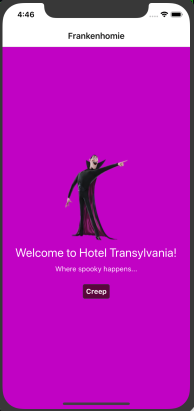
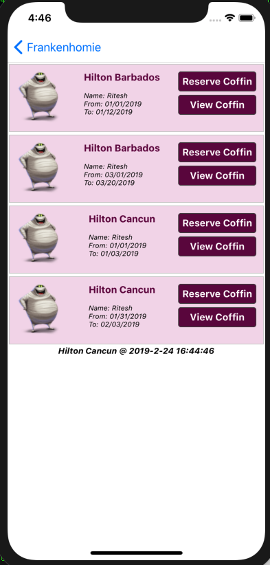
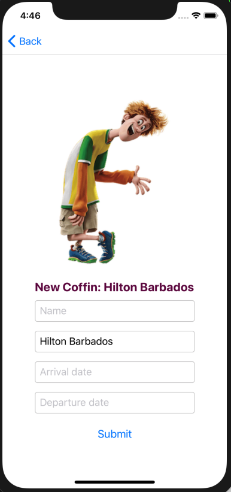
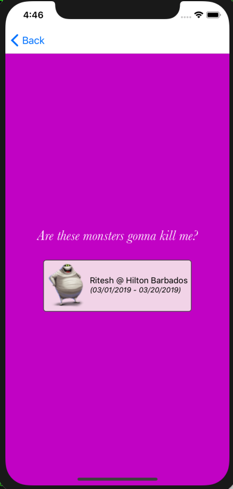

### Hotel Transylvania
*By: Ritesh Patel*

---

**Description**

Yes, it was immensely joyful to build this small React Native App. I absolutely loved it. Stumbled a bit in places but managed to get myself back up :). App is implemented using,

1) React Native
2) GraphQL
3) Apollo-Client

**State Management**

Ah! With your eyes closed you said `Redux`, right? Well sorry to disappoint you `young padawan`...I am using `Apollo Client's local statemanagement instead`. Cool stuff! Redux is great as well. And so is Vuex! Are `Redux and Vuex` twins? May be...

**Unit Testing**

`Jest` at rescue. I have all components passing `jest test`, but running into some issues with `Reservation query`. Rest seems to be ok. 

**Data**

`graphql backend` I used is public and seem to be quite polluted with inconsistent data. Therefore, I have added `filter` to my query and am pulling only data that belongs to me: `Ritesh`.

**Local State Management**

Yes, I know you can do quite a bit with `local state management`. This app shows how to display `last reservation made` and `which hotel`. It uses `client side queries and mutations`.

**Sample Queries / Mutation**

Here are sample `queries and mutations` I have used with the `client`. Nothing crazy, simple stuff.

```
# get all reservations for myself
query {
  reservations (where: {
    name: "Ritesh"
  }){
    name 
    hotelName 
    arrivalDate 
    departureDate 
  }
}

# delete a reservation
mutation {
  deleteReservation (where: {
    id: "cjsin721x1z2v0b86g2fte1v3"
  }){
    id
    name 
    hotelName 
    arrivalDate 
    departureDate 
  }
}


# add a reservation
mutation {
  createReservation(
    data: {
      name: "Ritesh",
      hotelName: "Hilton",
      arrivalDate: "02/22/2019",
      departureDate: "02/28/2019"
    }
  ){
    name,
    hotelName,
    arrivalDate,
    departureDate
  }
}
```


**App Snapshots**

*Landing Screen*



*Coffin Listing*



*Add Coffin*




*View Coffin*



*Missing Nails*


**Questions / Comments**

I truly enjoy `hands on` work. Built this app over this past weekend. Definitely put some hours in, but well worth it. 

Gimme a holler if you have any questions.

Cheers!

Ritesh


